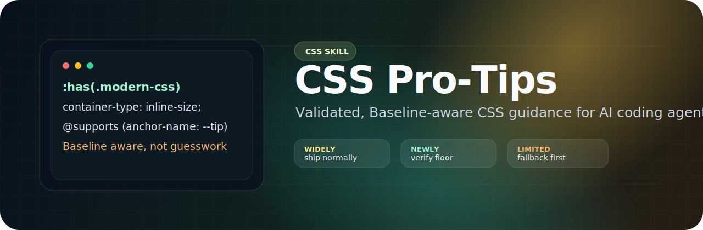

<p align="center">
  
</p>

<p align="center">
  <a href="https://www.npmjs.com/package/css-pro-tips"></a>
  <a href="./LICENSE"></a>
  <a href="https://web.dev/baseline"></a>
  <a href="./SKILL.md"></a>
  <a href="https://github.com/elkaix"></a>
  <a href="https://github.com/Pythoughts-labs"></a>
</p>

<h1 align="center">CSS Pro-Tips</h1>

<p align="center">
  <strong>A source-validated modern CSS skill for AI coding agents.</strong><br>
  Give Claude Code, Codex, Cursor, Pi, OpenCode, Kiro, or any <code>SKILL.md</code>-compatible agent a better CSS compass: current browser support, safer fallbacks, and practical patterns that replace old hacks with native CSS.
</p>

<p align="center">
  <a href="#quick-install">Quick install</a> |
  <a href="#whats-inside">What's inside</a> |
  <a href="#agent-install-paths">Agent install paths</a> |
  <a href="#verification">Verification</a>
</p>

---

## Why it exists

AI agents often mix timeless CSS patterns with outdated advice: float clearfixes, padding-ratio boxes, `100vh` mobile bugs, blanket resets, pointer-only interactions, and unguarded experimental features.

`css-pro-tips` gives an agent one curated CSS reference that is:

- **Baseline-aware:** modern CSS is bucketed by MDN Baseline status and support risk.
- **Fallback-first:** limited or audience-dependent features ship behind `@supports`.
- **Practical:** reset, layout, selector, focus, media, token, and modernization patterns are written as usable guidance.
- **Source-bound:** compatibility claims link back to MDN, web.dev Baseline, Can I use, or the relevant web-platform reference.

## What's inside

A single self-contained skill: [`SKILL.md`](./SKILL.md).

| Layer | What the agent gets | Examples |
|---|---|---|
| Evergreen CSS | Patterns that still hold up | `box-sizing`, `:not()`, `:is()`, `:where()`, `aspect-ratio`, `gap`, logical properties |
| Baseline widely available | Normal production CSS for evergreen targets | `:has()`, container queries, native nesting, `@layer`, `subgrid`, `color-mix()`, `clamp()` |
| Baseline newly available | Useful features that still need audience checks | `text-wrap`, `light-dark()`, `@scope`, `@starting-style`, anchor positioning, `field-sizing` |
| Limited availability | Enhancement-only features | `accent-color`, scroll-driven animations, `interpolate-size`, `calc-size()`, discrete transitions |
| Modern additions | Current CSS tricks with caveats | `@property`, container units, popovers, `scrollbar-gutter`, `content-visibility`, View Transitions, custom highlights |
| Modernization guide | Replacements for older tips | padding-ratio boxes, `max-height` disclosure, global owl selectors, strict `local()` fonts |

## Quick install

```bash
npm install css-pro-tips
```

Then copy `SKILL.md` into your agent's skill directory:

```bash
mkdir -p ~/.codex/skills/css-protips
cp node_modules/css-pro-tips/SKILL.md ~/.codex/skills/css-protips/
```

No npm? Download [`SKILL.md`](./SKILL.md) directly and place it in the same destination.

## Agent install paths

### Claude Code

```bash
mkdir -p ~/.claude/skills/css-protips
cp node_modules/css-pro-tips/SKILL.md ~/.claude/skills/css-protips/
```

For project-scoped use, place it at `.claude/skills/css-protips/SKILL.md`.

### OpenAI Codex CLI

```bash
mkdir -p ~/.codex/skills/css-protips
cp node_modules/css-pro-tips/SKILL.md ~/.codex/skills/css-protips/
```

For a team repo, check it into `.agents/skills/css-protips/SKILL.md`. Codex recognizes any directory containing a file named exactly `SKILL.md`.

### OpenCode

```bash
mkdir -p .opencode/skills/css-protips
cp node_modules/css-pro-tips/SKILL.md .opencode/skills/css-protips/
```

OpenCode also reads `.claude/skills/` and `.agents/skills/`, so a repo-local Claude or Codex install can be reused.

### Pi (`@earendil-works/pi-coding-agent`)

```bash
mkdir -p ~/.pi/skills/css-protips
cp node_modules/css-pro-tips/SKILL.md ~/.pi/skills/css-protips/
```

Invoke it in a session with `/skill:css-protips`.

### Cursor

Cursor uses rules (`.mdc`) instead of `SKILL.md`. Copy the skill into a rule file:

```bash
mkdir -p .cursor/rules
cp node_modules/css-pro-tips/SKILL.md .cursor/rules/css-protips.mdc
```

Add this frontmatter to `.cursor/rules/css-protips.mdc`:

```mdc
---
description: Modern, Baseline-aware CSS patterns and pro-tips
globs: ["**/*.css", "**/*.scss", "**/*.{tsx,jsx,vue,svelte,astro}"]
alwaysApply: false
---
```

### Kiro

Kiro uses steering files:

```bash
mkdir -p .kiro/steering
cp node_modules/css-pro-tips/SKILL.md .kiro/steering/css-protips.md
```

Use `~/.kiro/steering/` for a global install.

## Updating

```bash
npm update css-pro-tips
# then re-copy SKILL.md into your agent's skills dir
```

To track this repo directly on macOS or Linux:

```bash
ln -sf "$(pwd)/node_modules/css-pro-tips/SKILL.md" ~/.codex/skills/css-protips/SKILL.md
```

## Verification

- Current package version: [`1.1.0`](./package.json)
- Last documented validation window: July 2026
- Compatibility model: [MDN Baseline](https://developer.mozilla.org/en-US/docs/Glossary/Baseline/Compatibility)
- Change history: [`CHANGELOG.md`](./CHANGELOG.md)

Baseline is a browser-compatibility signal. It does not replace accessibility, keyboard, contrast, motion, performance, or project-specific browser testing.

## Contributing

Pull requests are welcome. When adding or changing a modern CSS claim:

1. Cite the Baseline status or compatibility source.
2. Keep fallbacks for limited or audience-dependent features.
3. Put superseded tricks in the modernization section instead of deleting useful history.
4. Keep examples small enough for an agent to reuse without cargo-culting a whole component.

## Maintainer

Created and maintained by **Mohamed Elkholy** ([elkaix](https://github.com/elkaix)) under the [Pythoughts Labs](https://github.com/Pythoughts-labs) organization.

## License

[MIT](./LICENSE) © 2026 Mohamed Elkholy.
